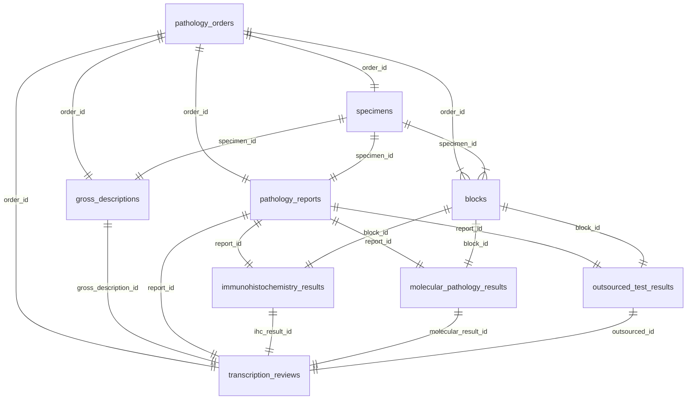

# 가상 병리 업무 연결 데이터 모델

## 목적과 범위

이 데이터셋은 국립암센터 폐암 공개 합성데이터의 각 행을 기준점으로 삼아 병리 전사·검수 웹 시제품의 업무 흐름을 모사한다. 실제 환자, 실제 병원 업무, 실제 검체 또는 실제 보고서를 나타내지 않는다. `ORD/SPC/GRS/BLK/RPT/IHC/MOL/EXT/REV-LUNG-2026-*` 형식의 모든 업무 ID는 교육용 가상 ID이며 이름, 생년월일, 병원등록번호, 환자번호 컬럼은 만들지 않았다.

원본 XLSX에서 직접 옮긴 값은 `source_type = public_synthetic`으로 표시한다. 원본에 없는 검사·검체·블록·보고서 연결키, 육안 소견, 면역병리, 위탁검사, 검수 완료 값은 `source_type = generated_demo`로 표시한다. `public_aggregate`와 `reference_metadata`는 프로젝트 전체 출처 분류에는 쓰지만 이 연결 테이블의 환자별 값으로 사용하지 않는다.

## 검사한 원본 XLSX 구조

- ZIP: `data/raw/ncc-lung-synthetic-20250107.zip`
- XLSX 내부 파일명: `암임상 라이브러리 합성데이터 train test set(폐암).xlsx`
- `Adjusted_synlung_trainset`: `A1:AH10001`, 데이터 10,000행
- `Adjusted_synlung_test`: `A1:AH5001`, 데이터 5,000행
- 두 시트 모두 34개 컬럼이며 시트별 `순번(No)`는 0부터 다시 시작한다.

실제 헤더는 다음과 같다.

1. `순번(No)`
2. `진단시연령(AGE)`
3. `조직학적진단명 코드 설명(Adenocarcinoma)`
4. `조직학적진단명 코드 설명(Large cell carcinoma)`
5. `조직학적진단명 코드 설명(Squamous cell carcinoma)`
6. `병기STAGE(TX)`
7. `병기STAGE(T0)`
8. `병기STAGE(T1)`
9. `병기STAGE(T1a)`
10. `병기STAGE(T1b)`
11. `병기STAGE(T1c)`
12. `병기STAGE(T2)`
13. `병기STAGE(T2a)`
14. `병기STAGE(T2b)`
15. `병기STAGE(T3)`
16. `병기STAGE(T4)`
17. `병기STAGE(N1)`
18. `병기STAGE(N2)`
19. `병기STAGE(N3)`
20. `병기STAGE(M1a)`
21. `병기STAGE(M1b)`
22. `병기STAGE(M1c)`
23. `음주종류(Type of Drink)`
24. `흡연여부(Smoke)`
25. `신장값(Height)`
26. `체중측정값(Weight)`
27. `FEV 검사 값(FEV1_FVC_P)`
28. `DLCO 검사 값(DLCO_VA_P)`
29. `EGFR mutation 발견 여부(EGFR mutation Detection)`
30. `수술여부(Operation)`
31. `항암치료여부(Chemotherapy)`
32. `방사선치료여부(Radiation Therapy)`
33. `사망여부(Death)`
34. `암진단후생존일수(Survival period)`

원본에는 `order_id`, `specimen_id`, `block_id`, `report_id`, `ihc_id`, `molecular_id`, `outsourced_id`, 병리 보고서 원문, 육안 소견, 면역병리 결과, 위탁검사 결과가 없다. 이 값들은 모두 시제품 구동을 위해 생성한다.

## 관계도



한 원본 행은 가상 검사 1건, 검체 1건, 육안 소견 1건, 블록 2건, 보고서 1건, 면역병리 1건, 분자병리 1건, 위탁검사 1건, 검수 완료 1건으로 확장된다. 총 15,000개 흐름과 150,000개 테이블 행이다.

## ID 규칙

| 객체 | 형식 | 예시 |
|---|---|---|
| 원본 합성 행 | `NCC-LUNG-{TRN|TST}-{원본 순번 5자리}` | `NCC-LUNG-TRN-00000` |
| 검사 의뢰 | `ORD-LUNG-2026-{전역 순번 5자리}` | `ORD-LUNG-2026-00001` |
| 검체 접수 | `SPC-LUNG-2026-{전역 순번 5자리}` | `SPC-LUNG-2026-00001` |
| 육안 소견 | `GRS-LUNG-2026-{전역 순번 5자리}` | `GRS-LUNG-2026-00001` |
| 블록 | `BLK-LUNG-2026-{전역 순번 5자리}-{A1|B1}` | `BLK-LUNG-2026-00001-A1` |
| 병리 결과 | `RPT-LUNG-2026-{전역 순번 5자리}` | `RPT-LUNG-2026-00001` |
| 면역병리 | `IHC-LUNG-2026-{전역 순번 5자리}` | `IHC-LUNG-2026-00001` |
| 분자병리 | `MOL-LUNG-2026-{전역 순번 5자리}` | `MOL-LUNG-2026-00001` |
| 위탁검사 | `EXT-LUNG-2026-{전역 순번 5자리}` | `EXT-LUNG-2026-00001` |
| 전사 검수 | `REV-LUNG-2026-{전역 순번 5자리}` | `REV-LUNG-2026-00001` |

`순번(No)`는 환자 ID가 아니라 원본 합성데이터 행 번호다. 훈련·테스트 시트에서 값이 겹치므로 원본 행 식별자는 `TRN` 또는 `TST`를 포함한다. 업무용 가상 ID는 화면 탐색을 위해 전역 순번으로 생성한다.

## 원본 매핑

| 대상 테이블 | 직접 매핑하는 실제 원본 컬럼 | source_type | 처리 원칙 |
|---|---|---|---|
| `pathology_reports` | 조직학적진단명 플래그 3개, `병기STAGE(...)` 플래그 17개, `수술여부(Operation)` | `public_synthetic` | 플래그를 배열로 보존한다. 없음 또는 복수 플래그는 검수 필요 상태로 표시한다. 병리학적 병기로 재해석하지 않는다. |
| `molecular_pathology_results` | `EGFR mutation 발견 여부(EGFR mutation Detection)` | `public_synthetic` | 0/1은 발견 여부 값, 99는 `not_applicable_in_source`로 보존한다. 변이명·검사법·검체 정보는 만들지 않는다. |
| 나머지 테이블 | 없음 | `generated_demo` | 병리 업무 화면 시제품 구동을 위한 결정적 가상 값만 생성한다. |

## 화면 타임라인

동일 사례 화면은 다음 순서로 이동한다.

검사 의뢰 -> 검체 접수 -> 육안 소견 -> 블록 -> 병리 결과 -> 면역병리 -> 분자병리 -> 위탁검사 -> 검수 완료

## 생성과 검증

```powershell
npm.cmd run data:generate:pathology-workflow
npm.cmd run data:test:pathology-workflow
```

생성기는 필수 시트 2개와 34개 헤더를 정확히 비교한다. 하나라도 바뀌면 임의 매핑 없이 실패한다. 검증기는 ID 중복, 연결되지 않은 외래키, 존재하지 않는 검사번호, 보고서와 검체 불일치, 위탁검사와 의뢰정보 불일치, 개인정보성 컬럼, `source_type` 누락을 검사한다.

현재 검증 결과:

- 9개 테이블
- 150,000행
- 중복 ID 0건
- 끊어진 외래키 0건
- 존재하지 않는 검사번호 0건
- 보고서-검체 불일치 0건
- 위탁검사-의뢰정보 불일치 0건
- `source_type` 누락 0건

## 웹 연결

웹의 `가상 연결 데이터` 화면은 전체 데이터와 동일한 ID를 사용하는 48건 미리보기를 `GET /api/data/pathology-workflow`에서 읽는다. 이 중 35건은 평가사례의 `sourceRowId`와 정확히 같은 `source_record_id`를 가진 테스트 행을 우선 포함한다. `검수 작업 목록`은 이 키가 일치하는 경우에만 해당 업무 유형과 `EVAL-...` 사례를 열며, 연결되지 않은 행은 임의의 평가사례 대신 선택한 `order_id`의 연결 데이터 화면으로 이동한다. 9단계 타임라인을 이동해도 선택한 `order_id`, `specimen_id`, `report_id`, `block_id`, `outsourced_id`, `review_id` 관계가 유지된다. API 응답은 저장하지 않고 `Cache-Control: no-store`를 사용한다.

## 한계

- 가상 연결은 원본이 제공한 임상 연결이 아니며, 실제 병원 시스템의 참조 무결성을 증명하지 않는다.
- 조직형과 TNM 플래그는 한 행에서 복수로 켜질 수 있으므로 단일 진단 또는 병기로 확정하지 않는다.
- 생성된 육안 소견, 표지자, 검사기관, 위탁검사 결과, 검수 완료 상태는 UI 검수 흐름 시험용이며 의학적 상관성을 주장하지 않는다.
- 실제 환자정보, 실제 문서, 실제 음성, 실제 병원등록번호를 입력하거나 결합하면 안 된다.
- 원본과 파생 파일의 GitHub 재배포는 제공처 이용조건을 확인한 뒤 결정해야 한다.
